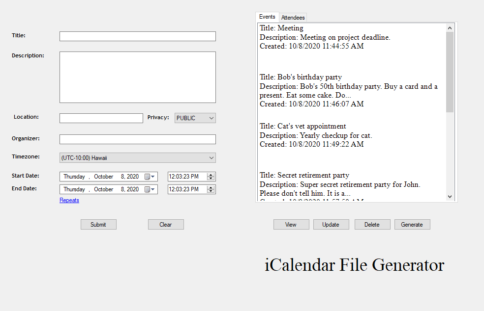
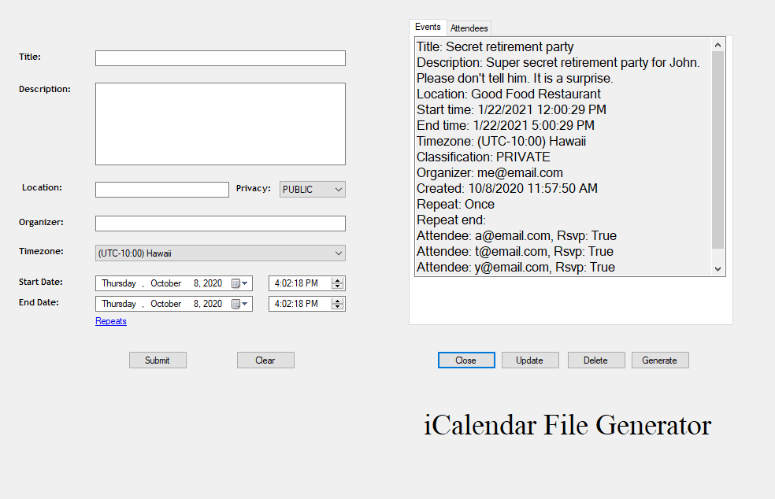
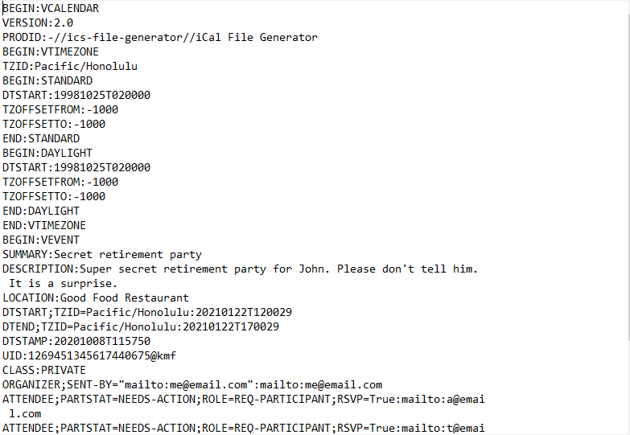

# iCalendar .ics File Generator

## Description
This program generates .ics files which are used in calendar and scheduling applications such as Google Calendar and 
Microsoft Outlook Calendar. The format of the file generated follows the standards described
in the [RFC 5545](https://tools.ietf.org/html/rfc5545) - Internet Calendaring and Scheduling Core Object Specifications (iCalendar).

    &nbsp;&nbsp;&nbsp;

---

## Inspiration
I based this project off of a group project which was done with React that I had in college. This program was 
created using C# and Winforms in Visual Studios 2019, and T-SQL using SSMS. The main reason I started this project 
was so I can practice and gain more experience with C# and SQL. Also to practice using the debugger and refactoring my code.

---

## Features
* Creating an event.
* Generating an ics file of the event with proper format.
* Adding attendees to the event.
* A relational database used to store events and attendees.
* Inserting new events.
* Updating old events.
* Listing all events.
* Viewing the details of each event.
* Deleting events and attendees.
* Generating ics files of old events.